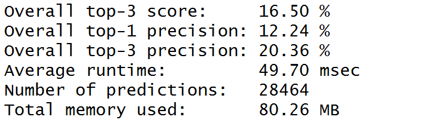

```{r, results="hide",error=FALSE,message=FALSE,echo=FALSE}
require(stringi)
require(stringr)
require(tm)
require(NLP)
require(RWeka)
require(quanteda)
require(ggplot2)
require(gridExtra)
```

This document was prepared as part of the Coursera Data Science Capstone program.

## Executive Summary
The WordPredictor App is predicting the next word based on user input. The app was built in the ShinyApps framework using the R programming language and is based on input data from blogs, twitter and news sites. This document describes briefly how the data was processed, which algorithm was chosen and how the app is working.

The app can be found under the following link: https://markusams.shinyapps.io/WordPredictor/

## The Data

### Data Exploration
This analysis was based on language data from blogs, twitter posts and news entries downloaded from [1]. To get a better understanding of the data, we had a look at the main features of each file. The main features were found with a script that can be found in the appendix of this report.


The most frequent words were found with a simple script (see the appendix). Below plot shows the top 15 terms fround in the twitter file.
```{r, echo=FALSE}
twitterFreq <- read.table("TwitterFrequency.txt")
g <- ggplot(head(twitterFreq,15),aes(x=reorder(input_clean,Freq),y=Freq)) + geom_bar(stat='identity',fill="steelblue") + coord_flip() + labs(y = "Frequency", x ="Words", title="Occurences in twitter file") + theme_minimal()
g
```

### Data Sampling
Before preparing the language model, the "generate samples" script (see appendix) was used to generate three samples of around 10 % of each input file. The percentage was found by trial and error and gave a good balance between performance and predictive value. As the source of the data did not matter for our application, the three samples where then combined into one object that served as a base for the next steps.

## Language Model
Probabilistic language models (also called "ngram models") assign probabilities to word sequences [2], which in turn can be used to predict the following word giving a specific input string. Therefore, we are using ngram models based on the data mentioned above to estimate the probability of the following word.

### Data Pre-Processing
Document frequency matrices were prepared with the following script. Note that this script also cleaned the input by removing foreign letters, numbers, punctuation and whitespaces and transforming the data to lower case. This was based on the assumption that predicting a word is not case sensitive in most cases.
```{r, eval=FALSE}
dfm.generate <- function(vec, n){
    ### Clean the input file
    vec <- gsub("[^[:alpha:][:space:]']", " ", vec)
    vec <- gsub("â ", "'", vec)
    vec <- gsub("ã", "'", vec)
    vec <- gsub("ð", "'", vec)
    
    ### Create Corpus
    my_corpus <- VCorpus(VectorSource(vec)) 
    
    ### Clean Corpus
    my_corpus <- tm_map(my_corpus, content_transformer(tolower))
    my_corpus <- tm_map(my_corpus, removeNumbers)
    my_corpus <- tm_map(my_corpus, removePunctuation)
    my_corpus <- tm_map(my_corpus, stripWhitespace)
    
    ## Transform VCorpus into a quanteda Corpus
    my_corpus <- quanteda::corpus(my_corpus)
    
    ### Create dfm
    dfm <- dfm(my_corpus, ngram = n, verbose=FALSE, concatenator = " ")
    
    ### Return dfm
    dfm
}
```
This procedure generates a document frequency matrix, which is a specific form of a document-term matrix used by R's quanted package [3]. In our case, this matrix contains ngrams (with n=1 to 5) and their frequency in the training data. 

### ngram Pruning
Because of the nature of language, relatively few ngrams contain most of the predictive information. Therefore, ultra low frequency items do not add a lot of value to our language model while consuming significant resources and memory when running the app. Hence, we can improve performance significantly by removing all items below a minimum frequency.
In this case, we used a minimum frequency of 3 for pruning. Any ngram with a count of less than 3 was removed before we built our algorithm.

## Data Storage
Data was stored as CSV files. For each n between 1 and 5 two files were generated: The top 10 ngrams and all ngrams with a frequency of at least 3.

```{r, eval=FALSE}
dfm1 <- dfm.generate(combined, 1)
dfm1 <- dfm_trim(dfm1, min_docfreq = 4)
x <- data.frame(cbind(names(words=topfeatures(dfm2, 10)),count=topfeatures(dfm2, 10)), row.names = c())
write.csv(x, "tp10bigrams.csv")
y <- data.frame(cbind(names(words=topfeatures(dfm2, 1000000)),count=topfeatures(dfm2, 1000000)), row.names = c())
write.csv(y, "bigrams.csv")
```

As an example, below the most frequent bigrams and quadgrams from our sample data
```{r, echo=FALSE}
top10bigrams<-read.csv("top10bigrams.csv",row.names=1)
g <- ggplot(top10bigrams,aes(x=reorder(words,count),y=count)) + geom_bar(stat='identity',fill="darkorchid3") + coord_flip() + labs(y = "Occurences", x ="ngrams", title="Occurences in sample data") + theme_minimal()
g
```

```{r, echo=FALSE}
top104grams<-read.csv("top10_4grams.csv",row.names=1)
g <- ggplot(top104grams,aes(x=reorder(words,count),y=count)) + geom_bar(stat='identity',fill="darkorchid3") + coord_flip() + labs(y = "Occurences", x ="ngrams", title="Occurences in sample data") + theme_minimal()
g
```

### Prediction algorithm
The selected algorithm was first described in [4] as "Stupid Backoff".


The algorithm essentially searches the highest level ngram (based on input) and finds the most frequent next word. If there are not enough result with this ngram, the next-lower ngram table is consulted, while the result from this table are discounted with a factor lambda (in our case 0.4) and so on until a pre-defined number of results are obtained (in our case 5). While other algorithms were considered, the current version of the word predictor app only uses stupid backoff as it seems the best combination of performance and result.

### Evaluation
To evaluate the algorithm a benchmarking tool was used [5]. The results can be seen below. 



As can be seen, the algorithm has an overall top-3 precision (this means that one of the first 3 predicted words was the correct word) of around 20 % while running on average for less than 50 milliseconds and using around 80 MegaBytes of Memory.
When comparing these results to the results of past students, the prediction precision and memory usage seemed to be in line with good results while the runtime was slightly higher. Given that the results were obtained on a midrange notebook, this might be due to the hardware used.

## Word Predictor App 
The Word Predictor App [6] is a shiny app which predicts the next word based on user entry. It features a single input field (input) which is fed into the algorithm any time the user hits "space".
When the user opens the app, the initial prediction shows the 5 most common words (unigrams) from the training data. After every word, this prediction is updated dynamically. The user can see the prediction in a table format with the next word and it's relative score (from stupid backoff).
The second tab "Make a sentence" enables the user to produce a sentence based on the algorithm. The user can enter the number of additional words the app should predict and one or several words to start the sentence with. Then he has to enter the submit button to generate the sentence. There is also a randomizer funciton. If it yes, the words will be selected at random within the five highest ranked words the algorithm predicts. If it is no, the highest word will be chosen
The app also has a third tab called documentation. This tab contains a number of links to this document, the presenation, the input data and other sources.

## Appendix
Script used to generate sample data, also available at Github [7]
```{r, eval=FALSE}
generateSample <- function (inputFile, outputFile, p){
    ##Create empty vector, open connection, determine number of lines in source
    a <- c()
    con <- file(inputFile, "r")
    NumberOfLines <- length(readLines(con))
    sample <- rbinom(n=NumberOfLines, size=1, prob=p)
    currentLine <- 1
    con <- file(inputFile, "r")
    ##Read the file line by line, check whether it should be included, append it to a
    while (currentLine < NumberOfLines){
        b <- readLines(con,1)
        if (sample[currentLine] == 1){
            a <- c(a,b)
            }
        currentLine <- currentLine + 1
    }
    ##Close Connection
    close(con)
    ##Write new file
    write(a, file=outputFile)
}
```

Script used to generate tables with word frequencies
```{r, eval=FALSE}
wordFrequencies <- function(inputFile,outputFile){
    ##Reads inputFile, splits it into words, counts, sorts
    ##and writes it to outputFile. The first row shows the
    ##total number of words in inputFile. After that, every 
    ##row shows the rank, the word and it's (absolute) 
    ##frequency. File is ordered decreasing
    input_a <- scan(inputFile, what="character", sep="\n")
    input_clean <- unlist(strsplit(tolower(input_a), "\\W"))
    freq<-sort(table(input_clean),decreasing=TRUE)
    write.table(freq,outputFile)
}
```

Script used to generate overview of all three files
```{r, eval=FALSE}
create.overview <- function(){
	### Reads all three files, counts words and lines, stores everything in a simple data frame and stores it in a file
    blogs <- scan("en_US.blogs.txt", what="character", sep="\n")
    news <- scan("en_US.news.txt", what="character", sep="\n")
    twitter <- scan("en_US.twitter.txt", what="character", sep="\n")
    words_blogs <- stri_count_words(blogs)
    words_news <- stri_count_words(news)
    words_twitter <- stri_count_words(twitter)
    lines_blogs <- length(blogs)
    lines_news <- length(news)
    lines_twitter <- length(twitter)
    overview <- data.frame(source = c("blogs","news","twitter"), lines = c(lines_blogs,lines_news,lines_twitter) , words = c(sum(words_blogs),sum(words_news),sum(words_twitter)))
    write.table(overview,"overview.txt")
}
```

## References

1: Source Data found at https://d396qusza40orc.cloudfront.net/dsscapstone/dataset/Coursera-SwiftKey.zip

2: Speech and Language Processing, Jurafsky / Martin. https://web.stanford.edu/~jurafsky/slp3/

3: Quanteda Package: https://cran.r-project.org/web/packages/quanteda/vignettes/quickstart.html

4: Large language models in machine translation by T. Brants et al, in EMNLP/CoNLL 2007 @ http://www.aclweb.org/anthology/D07-1090.pdf

5: Next word prediction benchmark: https://github.com/hfoffani/dsci-benchmark

6: The app can be found at https://markusams.shinyapps.io/WordPredictor/

7: The github repository for the app can be found at: https://github.com/markusams/WordPredictor