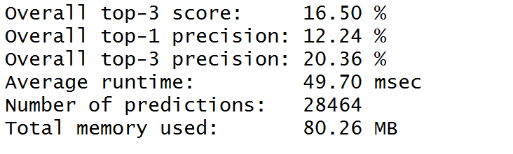
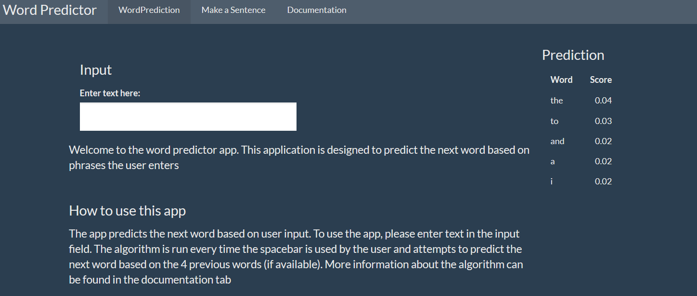

```{r setup, include=FALSE}
knitr::opts_chunk$set(echo = FALSE)
require(ggplot2)
```

## Introduction
This presentation gives an overview over the WordPredictor app. This app was developed as part of Coursera's Data Science Capstone (by Johns Hopkins) in May and June 2017.

The app predicts the next word in a sentence based on user entry. This presentation gives a brief overview over:

- The data used for this app
- The word prediction algorithm
- Performance of the app
- Layout and Usability

The app can be found at:

<a href="https://markusams.shinyapps.io/WordPredictor/">Word Predictor App</a>

## Data {.smaller}
This analysis was based on language data from blogs, twitter posts and news entries provided as part of the course. For the app, the following data cleaning and transformation steps were undertaken before building the prediction algorithm:

- Remove foreign letters, numbers, punctuation and whitespaces 
- Transformation to lower case
- Building term frequency matrix with ngrams with n=1 to 5

ngrams are word sequences that can be used in probabilistic language models to predict the next word using the previous words in a sentence. Below is an example of the most frequent "4grams" that were used in our model.

```{r}
top104grams<-read.csv("top10_4grams.csv",row.names=1)[-c(7,8,9,10),]
g <- ggplot(top104grams,aes(x=reorder(words,count),y=count)) + geom_bar(stat='identity',fill="darkorchid3") + coord_flip() + labs(y = "Occurences", x ="ngrams", title="Occurences in sample data") + theme_minimal()
g
```

## Algorithm
The selected algorithm was first described by Brants et al.as "Stupid Backoff".


The algorithm essentially searches the highest level ngram (based on input) and finds the most frequent next word. If there are not enough result with this ngram, the next-lower ngram table is consulted, while the result from this table are discounted with a factor lambda (in our case 0.4). This is repeated until a pre-defined number of results are obtained (in our case 5). The paper describing the approach can be found in the documentation tab of the app.

## Performance
To evaluate the algorithm a benchmarking tool was used. The results can be seen below.



- The overall top-3 precision is around 20 %
- Average runtime around 50 ms
- Memory usage around 80 MB

This seems to be in line with good results from other students of the same cours in the past.

## App


The app can be used in a very easy way, just type words into the input field, the app will run the algorithm every time the user enters a "Space" and display the top 5 predictions below. Note that there is some delay between entering data and updating the prediction (more than can be explained by the runtime of the algorithm). This is due to shinyapps reactive delay.
There is a second tab with a "make a sentence" function producing a sentence based on the same algorithm. 


